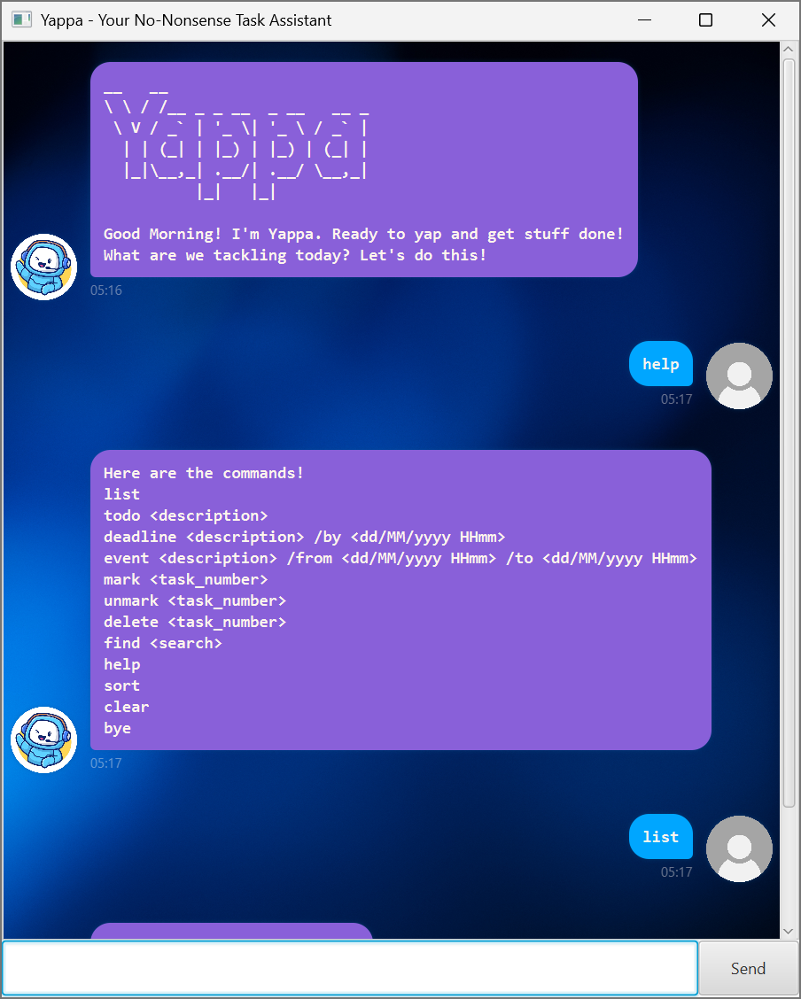

# Yappa

**Yappa** is a desktop task-management chatbot for users who prefer managing
their tasks through typed commands.

It supports todos, deadlines, and events, together with task-management
features such as searching, sorting, marking, deleting, and persistent storage.



---

## Yappa Details
* [User Guide](docs/README.md)
* [Product Website](https://minrui13.github.io/ip/)
* [GitHub Releases](https://github.com/minrui13/ip/releases)

---

## Running Yappa

Yappa requires **Java 25**. JavaFX is bundled with the packaged application, so it does not need to be installed separately.

1. Ensure that **Java 25** is installed on your computer.

2. Download `Yappa.jar` from the
   [latest GitHub release](https://github.com/minrui13/ip/releases/latest).

3. Place `Yappa.jar` in an empty folder where you want to run Yappa.

4. Open a terminal in that folder and run:

   ```console
   java -jar Yappa.jar
   ```
5. Yappa's GUI should appear. Type commands into the input box and press
Enter or the Send button to execute them.

6. See the user guide [User Guide](docs/README.md) for the full list of commands, examples and feature details!

--- 

## Developing Yappa

Use JDK 25 and open this repository as a Gradle project in your IDE.

Useful Gradle commands:

```shell
./gradlew run
./gradlew test
./gradlew check
./gradlew shadowJar
```

On Windows, replace ./gradlew with:

```shell
.\gradlew
```

For example:
```shell
.\gradlew check
```
The packaged application is created under:

`build/libs/`
